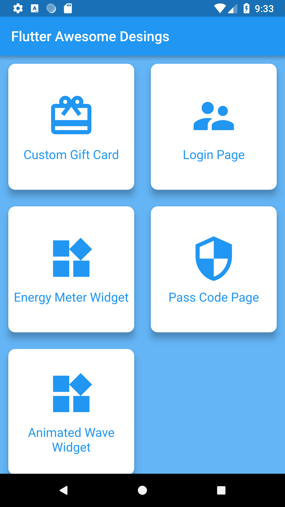
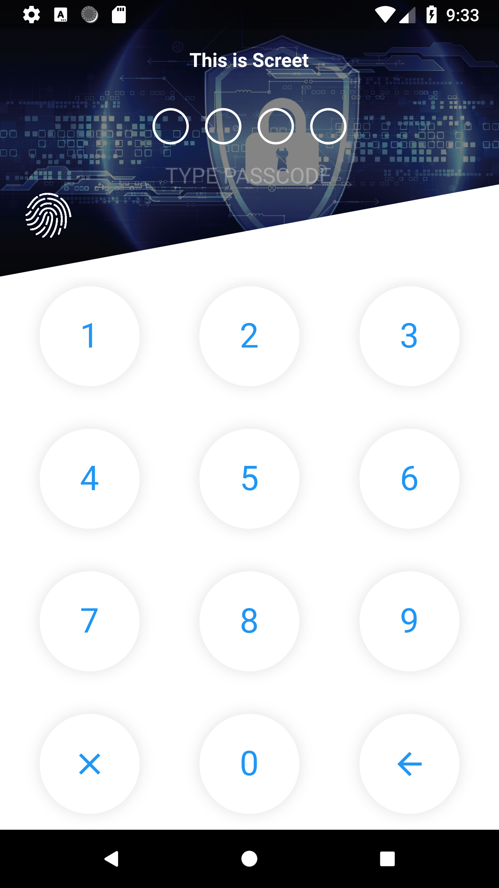

# Amazing Flutter UI Desings
  
  This repo gives you amazing flutter ui desing! If you like desings please star to support me!
  ### :heart: Star :heart: the repo to support the project or :smile:[Follow Me](https://github.com/kalismeras61). Thanks!
  
  Page Name | Pictures   
 --- | --- 
 [Home Page Dasboard Desing] | 
 [Onboarding Desing Page with Tinder Animations] | 
 [Login Page Design Page] | 
 [Credit Card Banking Page UI Desing] | 
 [Gift Card Page Desing] | 
 [Passcode Page Desing with full functionality! You can find as a package in pub.dartlang.com] | 
 [Energy Meter Widget] | 
 [Circle Animated Wave Widget ] | 

## Getting Started

This project is a starting point for a Flutter application.

A few resources to get you started if this is your first Flutter project:

- [Lab: Write your first Flutter app](https://flutter.io/docs/get-started/codelab)
- [Cookbook: Useful Flutter samples](https://flutter.io/docs/cookbook)

For help getting started with Flutter, view our 
[online documentation](https://flutter.io/docs), which offers tutorials, 
samples, guidance on mobile development, and a full API reference.
